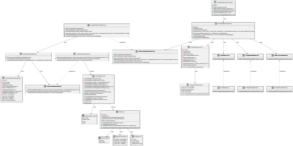

# US 2.2.12

## 1. Context

This user story addresses the need for logistics operators to register and manage physical resources essential for vessel and yard operations. Resources include cranes (fixed and mobile), trucks, and other equipment, each requiring unique identification, operational capacity details, and assignment to specific areas. The system must support creating, updating, and deactivating resources, ensuring that data is preserved for audit and planning purposes. Resources must be searchable and filterable by various attributes, and qualification requirements must be recorded to ensure only certified staff can operate them. While this story focuses on resource management, staff-resource pairing will be addressed in future user stories. Dependencies include US2.2.13 for qualification management.

## 2. Requirements

**US 2.2.12**  As a Logistics Operator, I want to register and manage physical
resources (create, update, deactivate)

**Acceptamce Criteria:**

- Resources include cranes (Fixed and mobile), trucks, and other equipment directly involved in vessel and yard operations.

- Each resource must have a unique alpha-numeric code and a description.

- Each resource must store its operational capacity, which varies according to the kind of resource, and, if any, the assigned area(e.g., Dock A, Yard B).

- Additional properties must include:
    - Current availability status (active m inactive, under maintenance).
    - Setup time (in minutes), if relevant, before starting operations.
    - (Staff) Qualification requirements, ensuring only properly certified staff can be scheduled with the resource.
- Deactivation/reactivation must not delete resource data but preserve it for audit and historical planning purposes.
- Resources must be searchable and filterable by code, description, kind of resource, status.

**Dependencies/References:**

*This US depends on US2.2.13 that is focused on the creation of Qualifications.*

**Forum Insight:**

>[Question] - 
Boa tarde,
"The system must therefore ensure that each resource (e.g., a crane or a truck) is matched with the required (number of) qualified staff members whose availability overlaps with the resource’s operational window."
É possível existir um membro da equipa que opera mais de um recurso? Por exemplo, temos um camião com uma janela operacional entre 8:00-15:00, e está pareado com um membro que tem a janela operacional entre 8:00-20:00. Esse membro pode também operar outro recurso no resto da sua janela, caso tenha qualificações?
>
>[Answer] - 
ATENÇÃO: nas US 2.2.11 e US 2.2.12 não estamos a atribuir/emparelhar staff com recursos físicos.
Estamos apenas a registar informação sobre cada elemento do staff logístico e quais são os recursos físicos existentes.
Mais tarde, no âmbito de outras US, teremos que explorar esta informação para concluir, por exemplo, que é necessário que uma grua seja operada por uma dada pessoa das 8h00 às 11h30 e por outra das 12h00 às 14h00. O staff pode operar qualquer recurso desde que possua as qualificações necessárias para o efeito.
Ao não compreender esta diferença, a probabilidade de fazerem asneira é grande! Muito cuidado.
>
>[Question] - 
Dear Client
When creating a physical resource, should its status be automatically assigned to available or should the Logistics Operator choose it.
Best Regards,
Grupo 3Di-03
>
>[Answer] - 
By default, it can be available.
>
>[Question] - 
Good morning,
I’d like to confirm how operational capacity should be defined for physical resources.
The specs mention:
Cranes: average containers/hour
Trucks: containers/trip and average speed/hour
Are these the only resource types to be considered, or will others (e.g., forklifts, terminal tractors, etc.) also be included?
If so, could you please clarify how their operational capacity should be measured or defined?
Thanks in advance for your clarification,
Joana Gama | FOURCORP
>
>[Answer] - 
It is enough considering cranes and trucks only.
>
>[Question] -
Dear client,
What are the fields that can be updated by the logistics operator when he/she wants to do so?
Best Regards,
Group 3DI-03
>
>[Answer] - 
Everything except its code, which is unique.
>
>[Question] -
Estimado Cliente,
Gostaríamos de confirmar alguns pontos relativamente à gestão de recursos físicos:
Quando um recurso é desativado, deve ser possível reativá-lo mais tarde?
Devemos solicitar ao utilizador o motivo da desativação no momento em que realiza essa ação?
No caso de um update a um recurso físico, o utilizador deve também ter a possibilidade de alterar o estado do recurso (por exemplo, de “ativo” para “em manutenção” ou vice-versa, ou até mesmo de "ativo" para "desativo")?
Agradecemos desde já a clarificação para garantirmos que a implementação cumpre as suas expectativas.
Com os melhores cumprimentos,
Francisco Ribeiro
>
>[Answer] -
1- Sim. Ao longo do tempo, um recurso pode ser desativado e ativado várias vezes, por exemplo, para efeitos de manutenção.
2- Faz sentido solicitar um motivo para desativação.
3- Podem tratar as operações em conjunto ou separadamente. Contudo, a (des)ativação pode ser feita sem qualquer outra alteração envolvida.
>
>[Question] -
Dear Client,
In what unit is the setup time expressed?
Best Regards,
Grupo 3DI-03
>
>[Answer] -
Across the entire system, data related with time must be record internally in the same time unit: seconds.
However, for input/output purpose, time values should be requested/presented in a format easing the user readability.
>
>[Question]- 
Even for the ETA and ETD? Or this can be expressed in HH:MM?
>
>[Answer]-
What I said before applies to time duration (measuring). E.g. when something takes 1h34m long.
It does not apply for specific time moments. E.g. a given event occurs at 10/10/2025 at 09:33.
ETA and ETD are date/time moments.
>
>[Question]- 
Dear Client,
Is there any constraints in terms of number of characteres for the alfa numeric code and description?
Best Regards,
Grupo 3DI-03.
>
>[Answer] -
Code: 20 chars max;
Description: 255 chars max.
>
>[Question]-
Dear Client,
"Each resource must store its operational capacity, which varies according to the kind of resource, and, if any, the assigned area"
When we are talking about the relation between storage area and physical resource, is it something that is related with the scheduling of operations(not in this sprint) or does this mean that, when we are registering a physical resource, it needs to have an storage area associated?
Best Regards,
Grupo 3DI-03
>
>[Answer]- 
As mentioned earlier, in this sprint we are not dealing with the scheduling and/or planning functionalities.
We only need to assign areas (docks, storage areas) to resources that, for some reason, are fixed.
For instance, an STS crane might be assigned to dock A while another STS crane might be assigned to dock B.
On the contrary, yard gantry cranes are not fixed - they are mobile - which means we do not assigned them to any area.


## 3. Analysis

Physical Resources Creation


Physical Resources Management


## 4. C4 Model

#### Context - Level 1


#### Containers - Level 2


#### Components - Level 3


#### Code - Level 4



#### Level +1

##### Qualification POST


##### Qualification UPDATE


## 5. Integration Tests

### Tests Related to Post

```csharp
    [Fact]
        public async Task PostPhysicalResource_ValidData_ReturnsCreatedAndOK()
        {
            var newResource = new PhysicalResourceDTO
            {
                Code = "PR004",
                Name = "Test Crane Delta",
                Description = "Test crane for integration testing purposes with detailed description",
                Kind = PhysicalResourceKind.STSCrane,
                SetupTimeMinutes = 20,
                OperationalCapacity = 40,
                AssignedArea = "Dock A",
                QualificationCode = "QUAL1",
                OperationalWindow = new OperationalWindowDTO
                {
                    StartDay = DayOfWeek.Monday,
                    EndDay = DayOfWeek.Friday,
                    StartTime = "09:00",
                    EndTime = "17:00"
                },
                Status = ResourceStatus.Available
            };

            var postResponse = await _client.PostAsJsonAsync("/api/PhysicalResources", newResource);
            Assert.Equal(HttpStatusCode.Created, postResponse.StatusCode);

            var createdResource = await postResponse.Content.ReadFromJsonAsync<PhysicalResourceDTO>();
            Assert.NotNull(createdResource);
            Assert.Equal(newResource.Code, createdResource.Code);
            Assert.Equal(newResource.Name, createdResource.Name);
            Assert.Equal(newResource.Description, createdResource.Description);
            Assert.Equal(newResource.Kind, createdResource.Kind);

            var getResponse = await _client.GetAsync($"/api/PhysicalResources/ByCode/{newResource.Code}");
            Assert.Equal(HttpStatusCode.OK, getResponse.StatusCode);
        }

        [Theory]
        [InlineData("", "Valid Name", "Valid description with multiple words")]
        [InlineData(null, "Valid Name", "Valid description with multiple words")]
        [InlineData("   ", "Valid Name", "Valid description with multiple words")]
        [InlineData("TOOLONGCODE1234567890", "Valid Name", "Valid description with multiple words")]
        [InlineData("CODE@#$", "Valid Name", "Valid description with multiple words")]
        public async Task PostPhysicalResource_InvalidCode_ReturnsBadRequest(string? code, string name, string description)
        {
            var invalidResource = new PhysicalResourceDTO
            {
                Code = code ?? string.Empty,
                Name = name,
                Description = description,
                Kind = PhysicalResourceKind.Truck,
                SetupTimeMinutes = 10,
                OperationalCapacity = 20,
                AssignedArea = "WH001",
                QualificationCode = "QUAL1",
                OperationalWindow = new OperationalWindowDTO
                {
                    StartDay = DayOfWeek.Monday,
                    EndDay = DayOfWeek.Friday,
                    StartTime = "08:00",
                    EndTime = "16:00"
                },
                Status = ResourceStatus.Available
            };

            var postResponse = await _client.PostAsJsonAsync("/api/PhysicalResources", invalidResource);
            Assert.Equal(HttpStatusCode.BadRequest, postResponse.StatusCode);
        }
```

### Test Related to Update

```csharp 
    [Fact]
        public async Task PutPhysicalResource_UpdatesSuccessfully()
        {
            var response = await _client.GetAsync("/api/PhysicalResources/ByCode/STS001");
            var resource = await response.Content.ReadFromJsonAsync<PhysicalResourceDTO>();
            Assert.NotNull(resource);
            Assert.Equal("STS001", resource.Code);

            resource.Name = "Updated STS Crane Alpha";
            resource.Description = "Updated description for STS Crane Alpha with detailed information";
            resource.OperationalCapacity = 60;

            var putResponse = await _client.PutAsJsonAsync($"/api/PhysicalResources/Update/{resource.Id}", resource);
            Assert.Equal(HttpStatusCode.OK, putResponse.StatusCode);

            var getResponse = await _client.GetAsync($"/api/PhysicalResources/ByCode/{resource.Code}");
            Assert.Equal(HttpStatusCode.OK, getResponse.StatusCode);
            var updatedResource = await getResponse.Content.ReadFromJsonAsync<PhysicalResourceDTO>();
            Assert.NotNull(updatedResource);
            Assert.Equal("Updated STS Crane Alpha", updatedResource.Name);
            Assert.Equal("Updated description for STS Crane Alpha with detailed information", updatedResource.Description);
            Assert.Equal(60, updatedResource.OperationalCapacity);
        }


        [Fact]
        public async Task PutPhysicalResource_ChangeCode_ReturnsBadRequest()
        {
            var response = await _client.GetAsync("/api/PhysicalResources/ByCode/STS001");
            var resource = await response.Content.ReadFromJsonAsync<PhysicalResourceDTO>();
            Assert.NotNull(resource);
            Assert.Equal("STS001", resource.Code);

            resource.Code = "NEWCODE";
            resource.Name = "Updated Name";
            resource.Description = "Updated description with multiple words for testing";

            var putResponse = await _client.PutAsJsonAsync($"/api/PhysicalResources/Update/{resource.Id}", resource);
            Assert.Equal(HttpStatusCode.BadRequest, putResponse.StatusCode);
        }

        [Theory]
        [InlineData("", "Valid description with multiple words for testing")]
        [InlineData(null, "Valid description with multiple words for testing")]
        [InlineData("   ", "Valid description with multiple words for testing")]
        public async Task PutPhysicalResource_InvalidName_ReturnsBadRequest(string? name, string description)
        {
            var response = await _client.GetAsync("/api/PhysicalResources/ByCode/MBL001");
            var resource = await response.Content.ReadFromJsonAsync<PhysicalResourceDTO>();
            Assert.NotNull(resource);
            Assert.Equal("MBL001", resource.Code);

            resource.Name = name ?? string.Empty;
            resource.Description = description;

            var putResponse = await _client.PutAsJsonAsync($"/api/PhysicalResources/Update/{resource.Id}", resource);
            Assert.Equal(HttpStatusCode.BadRequest, putResponse.StatusCode);
        }

        [Theory]
        [InlineData("Valid Name", "")]
        [InlineData("Valid Name", null)]
        [InlineData("Valid Name", "   ")]
        [InlineData("Valid Name", "Short")]
        public async Task PutPhysicalResource_InvalidDescription_ReturnsBadRequest(string name, string? description)
        {
            var response = await _client.GetAsync("/api/PhysicalResources/ByCode/TRUCK001");
            var resource = await response.Content.ReadFromJsonAsync<PhysicalResourceDTO>();
            Assert.NotNull(resource);
            Assert.Equal("TRUCK001", resource.Code);

            resource.Name = name;
            resource.Description = description ?? string.Empty;

            var putResponse = await _client.PutAsJsonAsync($"/api/PhysicalResources/Update/{resource.Id}", resource);
            Assert.Equal(HttpStatusCode.BadRequest, putResponse.StatusCode);
        }

        [Theory]
        [InlineData(-5)]
        [InlineData(-100)]
        public async Task PutPhysicalResource_InvalidOperationalCapacity_ReturnsBadRequest(int capacity)
        {
            var response = await _client.GetAsync("/api/PhysicalResources/ByCode/STS001");
            var resource = await response.Content.ReadFromJsonAsync<PhysicalResourceDTO>();
            Assert.NotNull(resource);
            Assert.Equal("STS001", resource.Code);

            resource.Name = "Valid Updated Name";
            resource.Description = "Valid updated description with multiple words for testing purposes";
            resource.OperationalCapacity = capacity;

            var putResponse = await _client.PutAsJsonAsync($"/api/PhysicalResources/Update/{resource.Id}", resource);
            Assert.Equal(HttpStatusCode.BadRequest, putResponse.StatusCode);
        }
```


