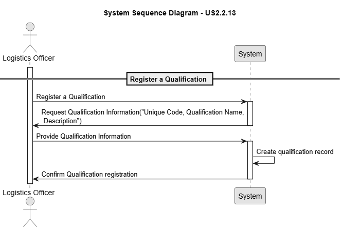
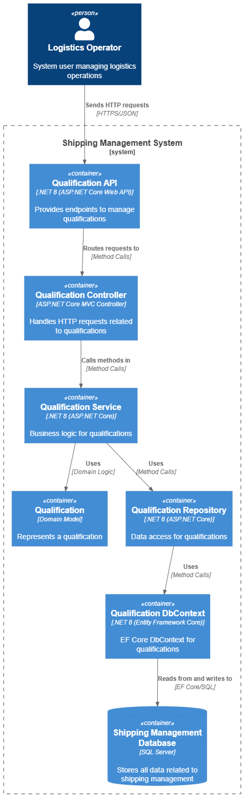
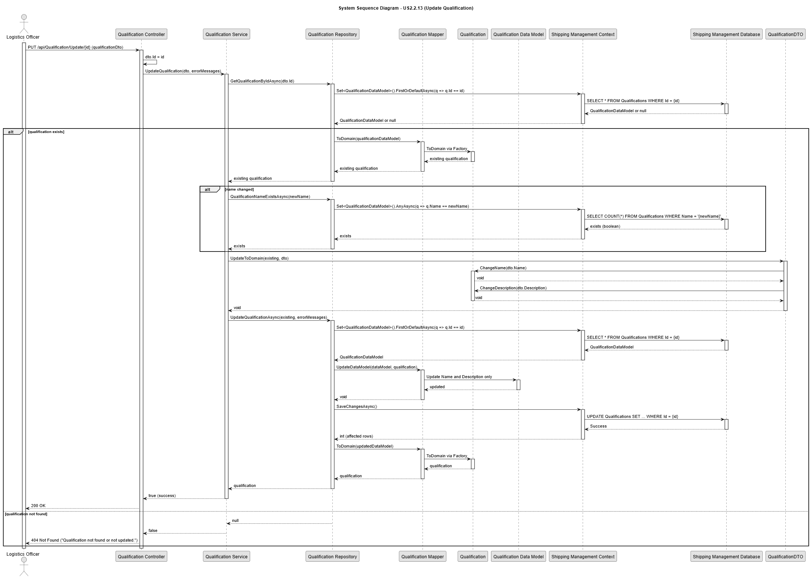

# US 2.2.13

## 1. Context

*Qualification: Each staff member is registered with the qualifications they hold (e.g., STS crane operator, yard gantry cranes operator, truck driver, yard planner). Certain resources may only be operated by staff with matching qualifications (e.g., an STS crane requires a certified STS crane operator).*

## 2. Requirements

**US 2.2.13** As a Logistics Operator, I want to register and manage qualifications (create, update), so that staff members and resources can be consistently associated with the correct skills and certifications required for port operations.

**Acceptance Criteria:**

- Each qualification has a unique code and a descriptive name (e.g., "STS Crane Operator," "Truck Driver").

- Qualifications must be searchable and filterable by code or name.

- A qualification must exist before it can be assigned to staff members or resources.

**Dependencies/References:**

*There is no dependencies associated to this US.*

**Forum Insight:**

>> In relation to the update action for qualifications, a question has arisen: when performing an update, is it possible to change the code, the name, or both?
> 
> Both are updatable.
However, you need to ensure that:
1.The code remains unique;
2.Existing relationships of either resources and/or of staff to qualifications must remain valid.

>>Bom dia cliente, surgiu-nos algumas questões sobre as qualificações:
Staff member deverá ter sempre alguma qualificação ou poderá não ter nenhum? Ou poderá ter mais que uma qualificação?
Um physical resource deverá ter sempre alguma qualificação associada? Por exemplo um carrinho de mão precisaria de alguma qualificação associada?
>
>1.A staff member might have no qualifications at all.
2.A staff member might have several qualifications.
3.A physical resource may require no qualifications to be operated.

## 3. Analysis

Qualification Registration

Qualification Update

## 4. C4 Model

#### Context - Level 1

#### Containers - Level 2

#### Components - Level 3

#### Code - Level 4

#### Level +1

Qualification POST

Qualification BET ByName

Qualification GET ByCode

Qualification UPDATE
