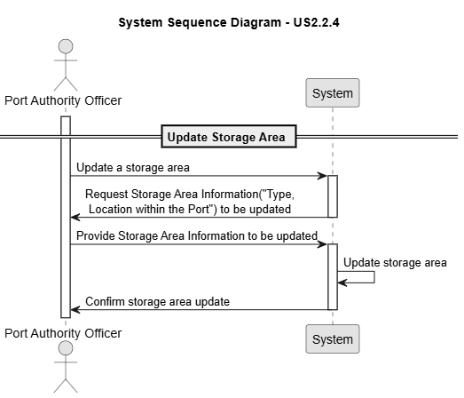
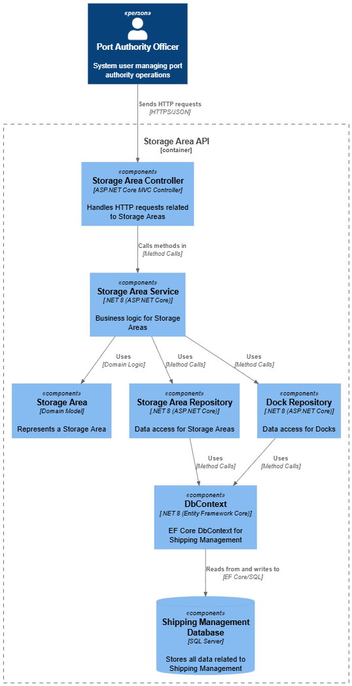
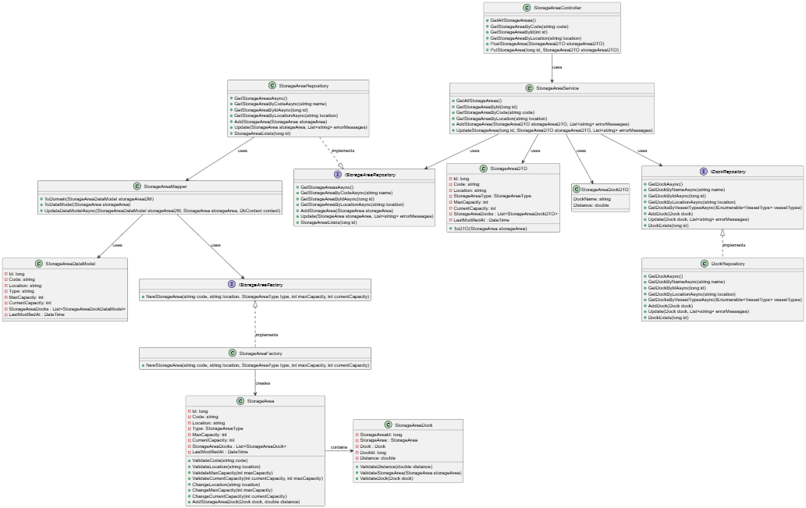
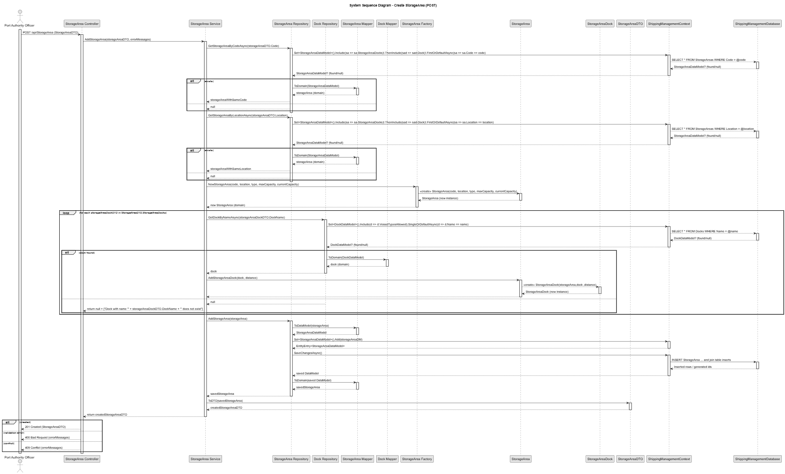
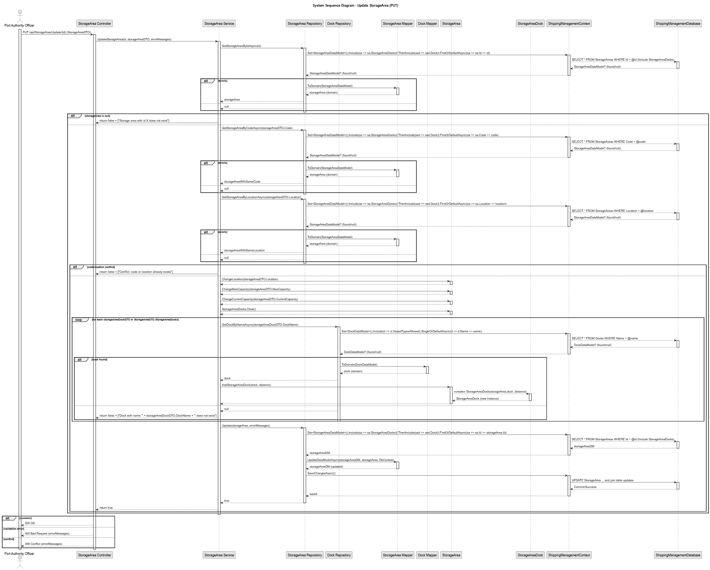

# US 2.2.4

## 1. Context

*The Port Authority needs to maintain accurate and up-to-date information about storage areas within the port to ensure efficient allocation of (un)loading and storage operations. Each storage area must be clearly identified and characterized by its type, location, and capacity, since this information directly impacts operational planning.*

## 2. Requirements

**US 2.2.4** As a Port Authority Officer, I want to register and update storage areas, so that (un)loading and storage operations can be assigned to the correct locations.

**Acceptance Criteria:**

- Each storage area must have a unique identifier, type (e.g., yard, warehouse), and location within the port.

- Storage areas must specify maximum capacity (in TEUs) and current occupancy.

- By default, a storage area serves the entire port (i.e., all docks). However, some storage areas (namely yards) may be constrained to serve only a few docks, usually the closest ones.

- Complementary information, such as the distance between docks and storage areas, must be manually recorded to support future logistics planning and optimization.

- Updates to storage areas must not allow the current occupancy to exceed maximum capacity.

**Dependencies/References:**

*There are no dependencies with other US's.*

**Forum Insight:**

>> My question is if the distance that he must insert is to all the docks., it means, if the port has 5 docks he must insert 5 distances?
> 
> If the storage area serves all docks, you need to know those distances.

>> Other question is if it's necessary to keep the distance between storage areas.
> 
> By the moment, that is not necessary.

>>It is stated in the assignment that we must keep track of the capacity and occupancy of storage areas such as yards and warehouses: However, is the specific layout of said storage (in rows, bays, and tiers) also relevant?If said layout is relevant, do we assume that these elements are organized in consistent grids (as in, the same amount of tiers across all rows and bays, the same amount of bays across all rows and tiers, etc.), or can there be areas with more or less tiers, bays, etc.?
>
>Yes, the layout may be relevant.However, you may assume a basic layout defined of a number of rows, bays and tiers. All rows have the same bays and tiers.

>>Are docks considered Storage Areas also ? Or we assume that Storage Areas are only the yards and warehouses ? 
>
>Docks are not storage areas. Right.


## 3. Analysis

Register Storage Area


Update Storage Area



## 4. C4 Model

#### Components - Level 3



#### Code - Level 4



### Model4+1

Register Storage Area



Update Storage Area




## 5. Tests

### Tests Related To Put

```
    [Fact]
    public async Task PutStorageArea_UpdatesSuccessfully()
    {
        var response = await _client.GetAsync("/api/StorageArea");
        response.EnsureSuccessStatusCode();
        var storageAreas = await response.Content.ReadFromJsonAsync<List<StorageAreaDTO>>();
        Assert.NotNull(storageAreas);
        var sa = storageAreas![0];

        sa.Location = sa.Location + " Updated";
        sa.MaxCapacity = sa.MaxCapacity + 100;

        var putResponse = await _client.PutAsJsonAsync($"/api/StorageArea/Update/{sa.Id}", sa);
        Assert.Equal(HttpStatusCode.OK, putResponse.StatusCode);

        var getResponse = await _client.GetAsync($"/api/StorageArea/ById/{sa.Id}");
        Assert.Equal(HttpStatusCode.OK, getResponse.StatusCode);
        var returned = await getResponse.Content.ReadFromJsonAsync<StorageAreaDTO>();
        Assert.NotNull(returned);
        Assert.Equal(sa.Location, returned.Location);
        Assert.Equal(sa.MaxCapacity, returned.MaxCapacity);
    }

```


```
    [Fact]
    public async Task PutStorageArea_DuplicateLocation_ReturnsConflict()
    {
        var response = await _client.GetAsync("/api/StorageArea");
        response.EnsureSuccessStatusCode();
        var storageAreas = await response.Content.ReadFromJsonAsync<List<StorageAreaDTO>>();
        Assert.NotNull(storageAreas);
        Assert.True(storageAreas!.Count >= 2);

        var target = storageAreas[0];
        var other = storageAreas[1];

        target.Location = other.Location;
        var putResponse = await _client.PutAsJsonAsync($"/api/StorageArea/Update/{target.Id}", target);
        Assert.Equal(HttpStatusCode.Conflict, putResponse.StatusCode);
    }

```

```
    [Theory]
    [InlineData("", "Loc", StorageAreaType.Yard, 100, 0)] //cannot change code
    [InlineData("WHOO1", "Loc", StorageAreaType.Warehouse, -1, 0)] //invalid max capacity
    [InlineData("WH001", "Loc", StorageAreaType.Warehouse, 100, -5)] //invalid current capacity
    [InlineData("WH001", "Loc", (StorageAreaType)999, 100, 0)] // Invalid enum value
    [InlineData("WH001", "Loc", StorageAreaType.Warehouse, 100, 150)] // currentCapacity > maxCapacity
    [InlineData("WH001", null, StorageAreaType.Warehouse, 100, 0)] //null location
    [InlineData("WH001", "", StorageAreaType.Warehouse, 100, 0)] //empty location
    [InlineData("WH001", "Loc", StorageAreaType.Warehouse, 0, 0)] //zero max capacity
    public async Task PutStorageArea_InvalidData_ReturnsBadRequest(string? code, string? location, StorageAreaType type, int maxCapacity, int currentCapacity)
    {
        var response = await _client.GetAsync("/api/StorageArea/ByCode/WH001");
        response.EnsureSuccessStatusCode();
        var storageArea = await response.Content.ReadFromJsonAsync<StorageAreaDTO>();
        Assert.NotNull(storageArea);


        storageArea.Code = code!;
        storageArea.Location = location!;
        storageArea.StorageAreaType = type;
        storageArea.MaxCapacity = maxCapacity;
        storageArea.CurrentCapacity = currentCapacity;

        var putResponse = await _client.PutAsJsonAsync($"/api/StorageArea/Update/{storageArea.Id}", storageArea);
        Assert.Equal(HttpStatusCode.BadRequest, putResponse.StatusCode);
    }
```

### Tests Related To Post

```
    [Theory]
    [InlineData("WH003", "Warehouse 3", StorageAreaType.Warehouse, 500, 10)]
    [InlineData("YD001", "Yard 1", StorageAreaType.Yard, 200, 0)]
    public async Task PostStorageArea_ThenGetByCode_ReturnsCreatedAndOk(string code, string location, StorageAreaType type, int maxCapacity, int currentCapacity)
    {
        var newStorageArea = new StorageAreaDTO
        {
            Code = code,
            Location = location,
            StorageAreaType = type,
            MaxCapacity = maxCapacity,
            CurrentCapacity = currentCapacity,
            StorageAreaDocks = new List<StorageAreaDockDTO>()
        };

        var docksResp = await _client.GetAsync("/api/Dock");
        docksResp.EnsureSuccessStatusCode();
        var docks = await docksResp.Content.ReadFromJsonAsync<List<DockDTO>>();
        if (docks != null && docks.Count > 0)
        {
            newStorageArea.StorageAreaDocks.Add(new StorageAreaDockDTO { DockName = docks[0].Name!, Distance = 12.5 });
        }

        var postResponse = await _client.PostAsJsonAsync("/api/StorageArea", newStorageArea);
        Assert.Equal(HttpStatusCode.Created, postResponse.StatusCode);

        var getResponse = await _client.GetAsync($"/api/StorageArea/ByCode/{code}");
        Assert.Equal(HttpStatusCode.OK, getResponse.StatusCode);
        var returned = await getResponse.Content.ReadFromJsonAsync<StorageAreaDTO>();
        Assert.NotNull(returned);
        Assert.Equal(code, returned.Code);
        Assert.Equal(location, returned.Location);
        Assert.Equal(maxCapacity, returned.MaxCapacity);
    }

```


```
    [Theory]
    [InlineData("WH001", "New Location", StorageAreaType.Warehouse, 1000, 0)]
    [InlineData("WH002", "Another Location", StorageAreaType.Warehouse, 2000, 0)]
    public async Task PostStorageArea_DuplicateCode_ReturnsConflict(string code, string location, StorageAreaType type, int maxCapacity, int currentCapacity)
    {
        var newStorageArea = new StorageAreaDTO
        {
            Code = code,
            Location = location,
            StorageAreaType = type,
            MaxCapacity = maxCapacity,
            CurrentCapacity = currentCapacity,
            StorageAreaDocks = new List<StorageAreaDockDTO>()
        };

        var postResponse = await _client.PostAsJsonAsync("/api/StorageArea", newStorageArea);
        Assert.Equal(HttpStatusCode.Conflict, postResponse.StatusCode);
    }

    [Theory]
    [InlineData("WH111", "North", StorageAreaType.Warehouse, 1000, 0)]
    [InlineData("WH122", "South", StorageAreaType.Warehouse, 2000, 0)]
    public async Task PostStorageArea_DuplicateLocation_ReturnsConflict(string code, string location, StorageAreaType type, int maxCapacity, int currentCapacity)
    {
        var newStorageArea = new StorageAreaDTO
        {
            Code = code,
            Location = location,
            StorageAreaType = type,
            MaxCapacity = maxCapacity,
            CurrentCapacity = currentCapacity,
            StorageAreaDocks = new List<StorageAreaDockDTO>()
        };

        var postResponse = await _client.PostAsJsonAsync("/api/StorageArea", newStorageArea);
        Assert.Equal(HttpStatusCode.Conflict, postResponse.StatusCode);
    }

```


```
    [Theory]
    [InlineData("", "Loc", StorageAreaType.Yard, 100, 0)]
    [InlineData("CODE1", "", StorageAreaType.Warehouse, 100, 0)]
    [InlineData("CODE2", "Loc", StorageAreaType.Warehouse, -1, 0)]
    [InlineData("CODE3", "Loc", StorageAreaType.Warehouse, 100, -5)]
    [InlineData("CODE4 dsdsa", "Loc", StorageAreaType.Warehouse, 250, 200)]
    [InlineData("CODE5", "Loc", (StorageAreaType)999, 100, 0)] // Invalid enum value
    [InlineData("CODE6", "Loc", StorageAreaType.Warehouse, 100, 150)] // currentCapacity > maxCapacity
    [InlineData(null, "Loc", StorageAreaType.Warehouse, 100, 0)]
    [InlineData("CODE7", null, StorageAreaType.Warehouse, 100, 0)]
    public async Task PostStorageArea_InvalidData_ReturnsBadRequest(string? code, string? location, StorageAreaType type, int maxCapacity, int currentCapacity)
    {
        var newStorageArea = new StorageAreaDTO
        {
            Code = code!,
            Location = location!,
            StorageAreaType = type,
            MaxCapacity = maxCapacity,
            CurrentCapacity = currentCapacity,
            StorageAreaDocks = new List<StorageAreaDockDTO>()
        };

        var postResponse = await _client.PostAsJsonAsync("/api/StorageArea", newStorageArea);
        Assert.Equal(HttpStatusCode.BadRequest, postResponse.StatusCode);
    }

```
