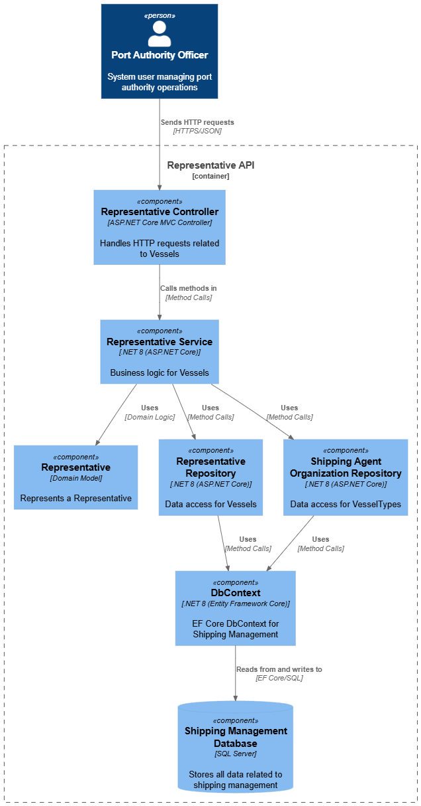
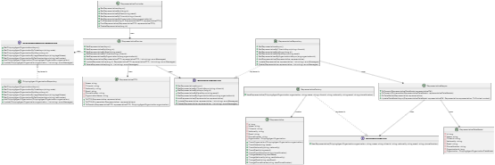
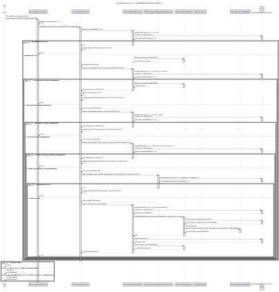

# US 2.2.6

## 1. Context

*Representatives are the official contacts and decision-makers acting on behalf of shipping agent organizations within the port’s digital system. Their registration and management are crucial to ensure that only authorized individuals can interact with the system and receive notifications related to operations and approvals.*

## 2. Requirements

**US 2.2.6** As a Port Authority Officer, I want to register and manage representatives of a shipping agent organization (create, update, deactivate), so that the right individuals are authorized to interact with the system on behalf of their
organization.

**Acceptance Criteria:**

- Each representative must be associated with exactly one shipping agent organization.

- Required representative details include name, citizen ID, nationality, email, and phone number.


**Dependencies/References:**

*There is a dependency with US2.2.5, since a shipping agent organization must exist so it can be assigned on the record.*

**Forum Insight:**

* No clarifications worth mention from the forum.


## 3. Analysis

Record Registration


## 4. C4 Model

#### Context - Level 1


#### Containers - Level 2


#### Components - Level 3



#### Code - Level 4




#### Level +1

##### Vessel Type POST


##### Vessel Type UPDATE


## 5. Integration Tests

### Tests Related to Post

```csharp
        [Theory]
        [InlineData("LegalName1", "Rep1", "CIT789", "PT", "test3@test.com", "333333333")]
        [InlineData("LegalName2", "Rep2", "CIT101", "PT", "test4@gmail.com", "444444444")]
        [InlineData("LegalName1", "Rep3", "CIT112", "PT", "test5@gmail.com", "555555555")]
        public async Task PostRepresentative_ThenGetByName_ReturnsCreated(string organization, string name, string citizenId, string nationality, string email, string phoneNumber)
        {
            var newRepresentative = new RepresentativeDTO
            {
                OrganizationName = organization,
                Name = name,
                CitizenId = citizenId,
                Nationality = nationality,
                Email = email,
                PhoneNumber = phoneNumber
            };

            var postResponse = await _client.PostAsJsonAsync("/api/Representative", newRepresentative);
            Assert.Equal(HttpStatusCode.Created, postResponse.StatusCode);

            var getResponse = await _client.GetAsync($"/api/Representative/ByName/{name}");
            Assert.Equal(HttpStatusCode.OK, getResponse.StatusCode);

            var returned = await getResponse.Content.ReadFromJsonAsync<RepresentativeDTO>();
            Assert.NotNull(returned);
            Assert.Equal(organization, returned.OrganizationName);
            Assert.Equal(name, returned.Name);
            Assert.Equal(citizenId, returned.CitizenId);
            Assert.Equal(nationality, returned.Nationality);
            Assert.Equal(email, returned.Email);
            Assert.Equal(phoneNumber, returned.PhoneNumber);
        }

        [Theory]
        [InlineData("", "Rep6", "CIT113", "PT", "test@gmail.com", "777777777")] // Empty organization
        [InlineData("Company1", "", "CIT113", "PT", "test@gmail.com", "777777777")] // Empty name
        [InlineData("Company1", "Rep6", "", "PT", "test@gmail.com", "777777777")] // Empty citizen ID
        [InlineData("Company1", "Rep6", "CIT113", "", "test@gmail.com", "777777777")] // Empty nationality
        [InlineData("Company1", "Rep6", "CIT113", "PT", "invalidemail", "777777777")] // Invalid email
        [InlineData("Company1", "Rep6", "CIT113", "PT", "test@gmail.com", "invalidphone")] // Invalid phone number
        public async Task PostRepresentative_InvalidData_ReturnsBadRequest(string organization, string name, string citizenId, string nationality, string email, string phoneNumber)
        {
            var newRepresentative = new RepresentativeDTO
            {
                OrganizationName = organization,
                Name = name,
                CitizenId = citizenId,
                Nationality = nationality,
                Email = email,
                PhoneNumber = phoneNumber
            };
            var postResponse = await _client.PostAsJsonAsync("/api/Representative", newRepresentative);
            Assert.Equal(HttpStatusCode.BadRequest, postResponse.StatusCode);
        }

```


### Tests Related to Update


```csharp
        [Theory]
        [InlineData("LegalName1", "Test1", "PT", "test@gmail.com", "111111111")]
        [InlineData("LegalName2", "Test2", "PT", "test2@gmail.com", "222222222")]
        public async Task PutRepresentative_UpdatesSuccessfully(string organization, string name, string nationality, string email, string phoneNumber)
        {
            var response = await _client.GetAsync("/api/Representative/ByCitizenId/CID1");
            Assert.Equal(HttpStatusCode.OK, response.StatusCode);
            var representative = await response.Content.ReadFromJsonAsync<RepresentativeDTO>();
            Assert.NotNull(representative);

            representative.OrganizationName = organization;
            representative.Name = name;
            representative.Nationality = nationality;
            representative.Email = email;
            representative.PhoneNumber = phoneNumber;

            var putResponse = await _client.PutAsJsonAsync($"/api/Representative/Update/{representative.Id}", representative);
            Assert.Equal(HttpStatusCode.OK, putResponse.StatusCode);

            var getResponse = await _client.GetAsync($"/api/Representative/ByID/{representative.Id}");
            if (getResponse.StatusCode != HttpStatusCode.OK)
            {
                var errorContent = await getResponse.Content.ReadAsStringAsync();
                throw new Xunit.Sdk.XunitException($"Expected OK but got {getResponse.StatusCode}. Response content: {errorContent}");
            }

            var returned = await getResponse.Content.ReadFromJsonAsync<RepresentativeDTO>();
            Assert.NotNull(returned);
            Assert.Equal(organization, returned.OrganizationName);
            Assert.Equal(name, returned.Name);
            Assert.Equal(nationality, returned.Nationality);
            Assert.Equal(email, returned.Email);
            Assert.Equal(phoneNumber, returned.PhoneNumber);
        }
        

        [Theory]
        [InlineData("", "Test1", "PT", "test@gmail.com", "111111111")] // Empty organization
        [InlineData("Company1", "", "PT", "test@gmail.com", "111111111")] // Empty name
        [InlineData("Company1", "Test1", "", "test@gmail.com", "111111111")] // Empty nationality
        [InlineData("Company1", "Test1", "PT", "invalidemail", "111111111")] // Invalid email
        [InlineData("Company1", "Test1", "PT", "test@gmail.com", "invalidphone")] // Invalid phone number
        public async Task PutRepresentative_InvalidData_ReturnsBadRequest(string organization, string name, string nationality, string email, string phoneNumber)
        {
            var response = await _client.GetAsync("/api/Representative/ByCitizenId/CID1");
            Assert.Equal(HttpStatusCode.OK, response.StatusCode);
            var representative = await response.Content.ReadFromJsonAsync<RepresentativeDTO>();
            Assert.NotNull(representative);

            representative.OrganizationName = organization;
            representative.Name = name;
            representative.Nationality = nationality;
            representative.Email = email;
            representative.PhoneNumber = phoneNumber;

            var putResponse = await _client.PutAsJsonAsync($"/api/Representative/Update/{representative.Id}", representative);
            Assert.Equal(HttpStatusCode.BadRequest, putResponse.StatusCode);
        }

```