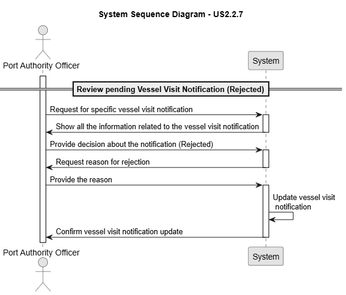

# US 2.2.7

## 1. Context

*Vessel Visit Notifications are the formal requests submitted by shipping agent representatives to announce and schedule a vessel’s arrival at the port. Reviewing these notifications is a critical responsibility of the Port Authority Officer, ensuring that docking operations are managed efficiently and securely. By approving or rejecting notifications, officers maintain control over berthing schedules, prevent conflicts in dock allocation, and guarantee that only properly documented vessels gain access.*

## 2. Requirements

**US 2.2.7** As a Port Authority Officer, I want to review pending Vessel Visit Notifications and approve or reject them, so that docking schedules remain under port control.

**Acceptance Criteria:**

- When a notification is approved, the officer must assign a (temporarily) dock on which the vessel should berth.

- When a notification is rejected, the officer must provide a reason for rejection (e.g., information is missing).

- If rejected, the shipping agent representative might review / update the notification for further new decision.

- All decisions (approve/reject) must be logged with timestamp, officer ID, and decision outcome for auditing purposes.

**Dependencies/References:**

*There is a dependency with US2.2.8, since a vessel visit notification must exist so it can be reviewed in this us.*
*There is a dependency with US2.2.3, since a dock must exist so it can be assigned if the visit notification is accepted.*

**Forum Insight:**

Still no questions asked about the US'S.

## 3. Analysis

Review and Approved 

Review and Rejected

