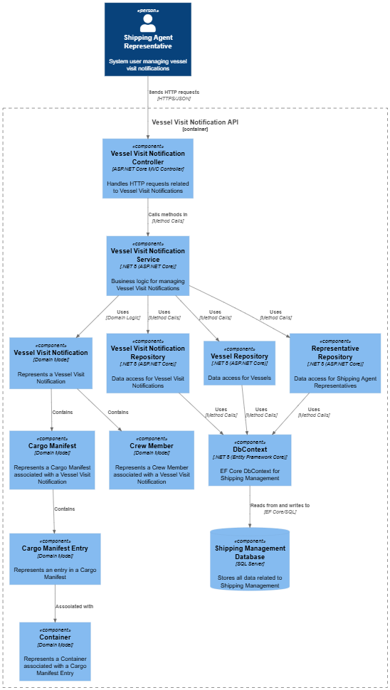
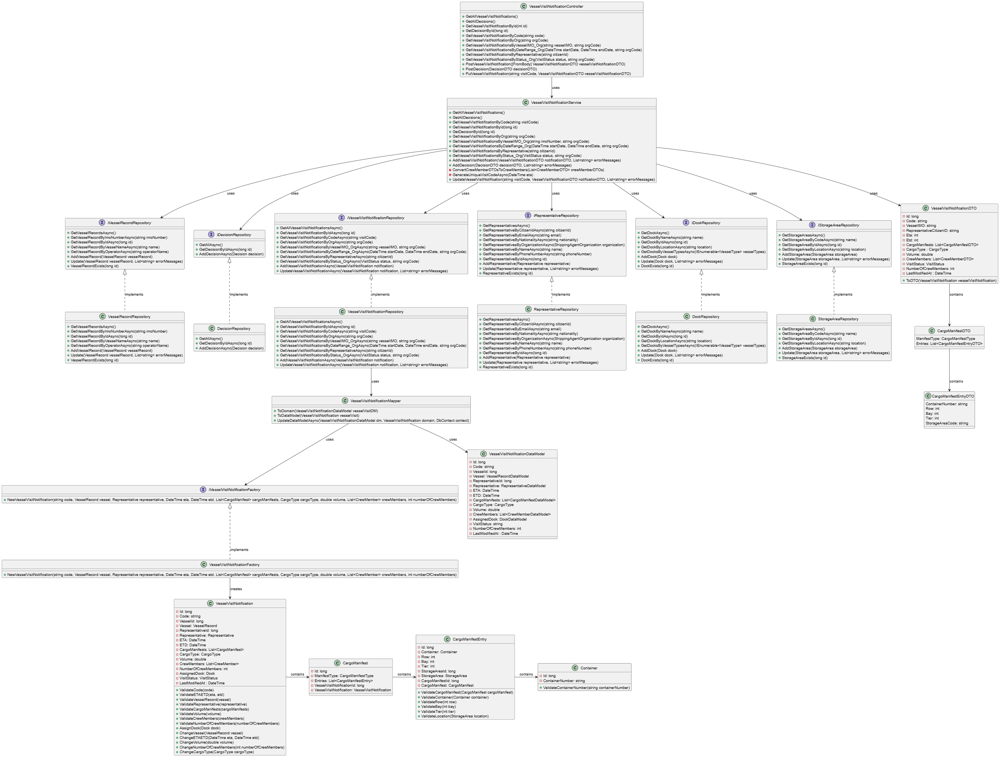
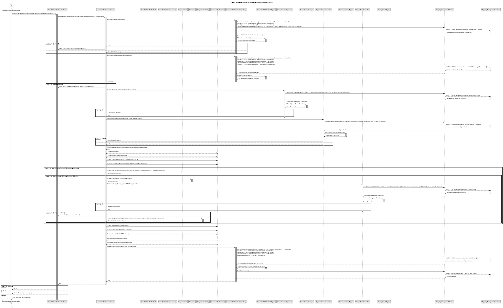

# US 2.2.9

## 1. Context

*A Vessel Visit represents the planned arrival and departure of a vessel at the port, including associated operations such as cargo loading and unloading. The process begins when a shipping agent representative submits a Vessel Visit notification for an authorized vessel, providing key information such as expected arrival (ETA), departure (ETD), cargo type and volume, and any special handling requirements.
Additionally, a Vessel Visit Notification may also include basic crew information to support regulatory and operational needs. For most visits, this information is limited to the captain’s name and the total number of crew members on board However, when the vessel carries dangerous cargo, the notification must explicitly identify the designated crew safety officers, as their presence is a  prerequisite for port operations involving hazardous materials.*

## 2. Requirements

**US 2.2.9** As a Shipping Agent Representative, I want to change / complete a Vessel Visit Notification while it is still in progress, so that I can correct errors or withdraw requests if necessary.


**Acceptance Criteria:**

- Status can be maintained "in progress" or changed to "submitted / approval pending" by the representative.

**Dependencies/References:**

*There is a dependency with US2.2.6, since a shipping agent representative must exist to change/complete a vessel visit notification.*
*There is a dependency with US2.2.8, since a vessel visit notification must exist so it can be changed or completed.* 


**Forum Insight:**

>> In the US, the term "withdraw request" is often used. Could you clarify what this action consists of?
Specifically:\
When an order is withdrawn, can it later be restored, or does it disappear permanently?\
If the status of a notification is "submitted", is it possible to withdraw that request?
>
> Under the US 2.2.9, the mention to "withdraw request" refers to the ability of the Shipping Agent Representative to mark a given Vessel Visit Notification as having no intention to complete it til the point of submitting it for approval.\
As so, (s)he does not see that Notification as being "in progress" any more. However, the Notification should not be deleted since, occasionally, (s)he may change her/his mind a resume it from there.\
After being submitted, the Shipping Agent Representative cannot change the Notification.

>>Reparei que na US 2.2.8 refere, no acceptance criteria, que informação pode ser adicionada no futuro. Apenas deu o exemplo de adicionar informação da carga.\
Informação de tripulantes ou outros dados podem ser alterados ou adicionados mais tarde? Ou apenas certas informações podem ser adicionadas/alteradas.
>
>Enquanto o estado do Vessel Visit Notification for "in progress" (US 2.2.8 e US 2.2.9) todos os seus dados podem ser alterados/adicionados.
Depois de ser submetido, já não pode ser alterado pelo Shipping Agent Representative.

>>Should the shipping agent representative who requests to modify or remove a Vessel Visit Notification be allowed to change only the notifications they created, or any notification in the system, regardless of who created it?
>
>Most of the time, Shipping Agent Representative work on the Vessel Visit Notifications created by themselves.\
However, it may be possible to work on Vessel Visit Notifications submitted by other representatives working for the same shipping agent organization.

## 3. Analysis


## 4. C4 Model

#### Components - Level 3



#### Code - Level 4



### Model4+1

Update Vessel Visit Notification




## 5. Tests

### Tests Related To Put

```
    [Fact]
    public async Task Put_UpdateValid_ReturnsOk()
    {
        var dto = BuildValidDto();
        var createResp = await _client.PostAsJsonAsync("/api/VesselVisitNotification", dto);
        Assert.Equal(HttpStatusCode.Created, createResp.StatusCode);
        var created = await createResp.Content.ReadFromJsonAsync<VesselVisitNotificationDTO>();
        Assert.NotNull(created);

        created!.Volume = 200.0;
        created.Eta = created.Eta.AddDays(1);
        created.Etd = created.Etd.AddDays(1);
        created.CargoType = CargoType.General;

        var updResp = await _client.PutAsJsonAsync($"/api/VesselVisitNotification/Update/{created.Code}", created);
        Assert.Equal(HttpStatusCode.OK, updResp.StatusCode);

        // verify
        var getResp = await _client.GetAsync($"/api/VesselVisitNotification/ByCode/{created.Code}");
        getResp.EnsureSuccessStatusCode();
        var updated = await getResp.Content.ReadFromJsonAsync<VesselVisitNotificationDTO>();
        Assert.NotNull(updated);
        Assert.Equal(200.0, updated!.Volume);
    }

```


```
    
    [Fact]
    public async Task Put_OverlappingVisit_ReturnsBadRequest()
    {
        var dto = BuildValidDto();
        var r1 = await _client.PostAsJsonAsync("/api/VesselVisitNotification", dto);
        Assert.Equal(HttpStatusCode.Created, r1.StatusCode);
        var created1 = await r1.Content.ReadFromJsonAsync<VesselVisitNotificationDTO>();

        var dto2 = BuildValidDto();
        dto2.Eta = dto.Eta.AddDays(5);
        dto2.Etd = dto.Etd.AddDays(5);
        var r2 = await _client.PostAsJsonAsync("/api/VesselVisitNotification", dto2);
        Assert.Equal(HttpStatusCode.Created, r2.StatusCode);
        var created2 = await r2.Content.ReadFromJsonAsync<VesselVisitNotificationDTO>();

        created2!.Eta = created1!.Eta.AddDays(0);
        created2.Etd = created1.Etd.AddHours(1);

        var updResp = await _client.PutAsJsonAsync($"/api/VesselVisitNotification/Update/{created2.Code}", created2);
        Assert.Equal(HttpStatusCode.BadRequest, updResp.StatusCode);
        var errors = await updResp.Content.ReadFromJsonAsync<List<string>>() ?? new List<string>();
        Assert.Contains(errors, e => e.ToLowerInvariant().Contains("overlapping visit") || e.ToLowerInvariant().Contains("overlap"));
    }

    [Fact]
    public async Task Put_MultipleLoadingManifests_ReturnsBadRequest()
    {
        var dto = BuildValidDto();
        var createResp = await _client.PostAsJsonAsync("/api/VesselVisitNotification", dto);
        Assert.Equal(HttpStatusCode.Created, createResp.StatusCode);
        var created = await createResp.Content.ReadFromJsonAsync<VesselVisitNotificationDTO>();

        created!.CargoManifests!.Add(new CargoManifestDTO
        {
            ManifestType = CargoManifestType.Loading,
            Entries = new List<CargoManifestEntryDTO>
            {
                new CargoManifestEntryDTO { ContainerNumber = "ABCU2223334", Row = 1, Bay = 2, Tier = 1, StorageAreaCode = "WH001" }
            }
        });

        var updResp = await _client.PutAsJsonAsync($"/api/VesselVisitNotification/Update/{created.Code}", created);
        Assert.Equal(HttpStatusCode.BadRequest, updResp.StatusCode);
        var errors = await updResp.Content.ReadFromJsonAsync<List<string>>() ?? new List<string>();
        Assert.Contains(errors, e => e.Contains("Cargo manifests cannot contain more than one loading manifest") || e.Contains("more than one loading"));
    }

    
    [Fact]
    public async Task Put_InvalidETAETD_ReturnsBadRequest()
    {
        var dto = BuildValidDto();
        var createResp = await _client.PostAsJsonAsync("/api/VesselVisitNotification", dto);
        Assert.Equal(HttpStatusCode.Created, createResp.StatusCode);
        var created = await createResp.Content.ReadFromJsonAsync<VesselVisitNotificationDTO>();

        created!.Eta = DateTime.UtcNow.AddDays(10);
        created.Etd = DateTime.UtcNow.AddDays(9);
        var updResp = await _client.PutAsJsonAsync($"/api/VesselVisitNotification/Update/{created.Code}", created);
        Assert.Equal(HttpStatusCode.BadRequest, updResp.StatusCode);
        var errors = await updResp.Content.ReadFromJsonAsync<List<string>>() ?? new List<string>();
        Assert.Contains(errors, e => e.Contains("ETA must be earlier") || e.Contains("ETA must be earlier than ETD"));
    }

    [Fact]
    public async Task Put_NumberOfCrewMembers_ReduceBelowCurrent_ReturnsBadRequest()
    {
        var dto = BuildValidDto();
        dto.NumberOfCrewMembers = 5;
        var createResp = await _client.PostAsJsonAsync("/api/VesselVisitNotification", dto);
        Assert.Equal(HttpStatusCode.Created, createResp.StatusCode);
        var created = await createResp.Content.ReadFromJsonAsync<VesselVisitNotificationDTO>();
        Assert.NotNull(created);

        created!.NumberOfCrewMembers = 1;
        var updResp = await _client.PutAsJsonAsync($"/api/VesselVisitNotification/Update/{created.Code}", created);
        Assert.Equal(HttpStatusCode.BadRequest, updResp.StatusCode);
        var errors = await updResp.Content.ReadFromJsonAsync<List<string>>() ?? new List<string>();
        Assert.Contains(errors, e => e.Contains("Number of crew members must be greater than the current number of crew members") || e.Contains("Number of crew members"));
    }

```


