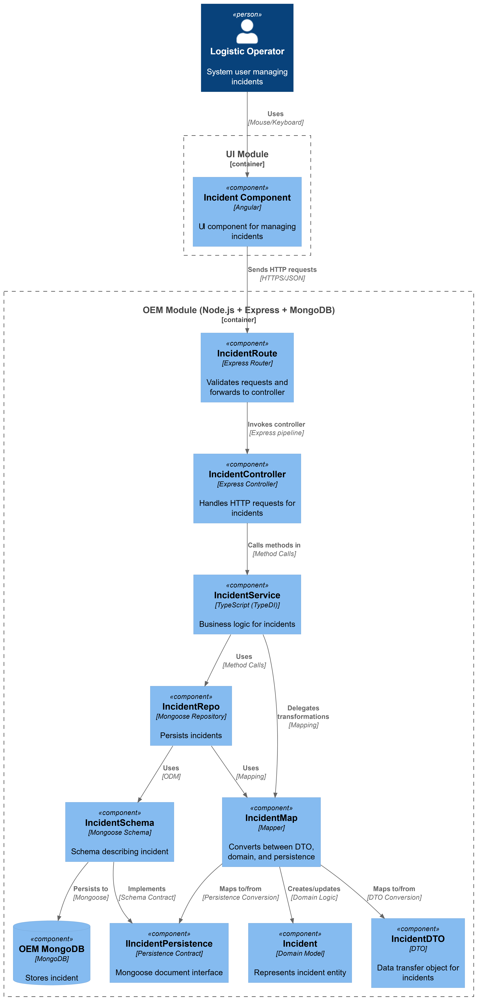

# US 4.1.13

## 1. Context

*The Operations & Execution Management (OEM) module is responsible for managing execution data
of port activities. It bridges the gap between operations planning and operations execution, allowing
the system to record what actually happens during each vessel visit and how it differs from the
planned schedule. Among others, this module aims to support:\
Incidents & Incident Types – managing unexpected events or disruptions affecting operations
and their classification.*

## 2. Requirements

**US 4.1.13** As a Logistics Operator, I want to record and manage incidents that
affect the execution of port operations, so that delays and operational
disruptions can be accurately tracked, scoped, and analyzed.

**Acceptance Criteria:**

- CRUD operations for incidents must be available via the 
REST API.

- The SPA must allow:\
o Filtering and listing incidents by vessel, date range, severity, or status
(active/resolved).\
o Quickly associating or detaching affected VVEs.\
o Highlighting active incidents that are currently impacting operations.\

- Each incident record must include: a unique generated ID, a reference to its Incident Type,
start and end timestamps (allowing ongoing incidents to be marked as active), a severity level
(e.g., minor, major, critical), a free-text description, a responsible user (the creator).

- An incident may affect: (i) all ongoing VVEs; (ii) specific VVEs (manually selected); or (iii)
upcoming VVEs (planned for later execution on the same day or period).

- When an incident is marked as resolved (i.e., end time is set), its duration must be computed
automatically.

**Dependencies/References:**

*There is a dependency on US2.2.12 because to create an incident it needs to have a incident type already created.*


**Forum Insight:**

>> Each incident record must include: a unique generated ID, a reference to its Incident Type, start and end timestamps (allowing ongoing incidents to be marked as active), a severity level (e.g., minor, major, critical), a free-text description, a responsible user (the creator).\
Considering that the Incident Record inherits all the characteristics of its Incident Type, what is the role and the practical value of including the severity directly in the Incident Record (in addition to referencing the Type)?\
Is the objective of this duplication to allow the severity of a specific occurrence (the Record) to be adjusted (e.g., from Major to Critical or to Minor) by the responsible user, independently of the Type's standard classification, thus reflecting the real and contextualized impact of the incident at a given moment? Or is there another primary reason for not depending exclusively on the severity defined in the Type?
> 
> You got it right.\
The purpose of this duplication is precisely this – to allow the severity of a specific occurrence (the Record) to be adjusted by the responsible user, independently of what its type states, thus reflecting the real and contextualized impact of the incident at a given moment.\
Thus, the severity information derived from the type serves as a predefined value that can be changed by the responsible user.

>> An incident may affect: (i) all ongoing VVEs; (ii) specific VVEs (manually selected); or (iii)
upcoming VVEs (planned for later execution on the same day or period).\
Mas na US 4.1.7 diz que as VVEs são criadas no momento que o barco chega ao porto. Assim sendo como funcionaria o ponto (iii) "upcoming VVEs"?  
> 
> What that point (i.e., "(iii) upcoming VVEs") intends to emphasize is that at the time of registering an incident it may not be possible to identify all affected VVEs. Therefore, it may be necessary later to affect other VVEs, namely those that were created in the meantime (for instance, via US 4.1.7).\
For example, when registering the occurrence of an incident (e.g., dense and thick fog), the logistics operator indicates that all VVEs in progress are affected.\
Later, a vessel enters on the port's area of ​​influence/control and, therefore, the respective (new) VVE is created in the system.
Given that there is an ongoing incident, the system could ask the user if this VVE is (or is not) also affected by this ongoing incident.\
This would be excellent! If the system does not do this, or the user has made a mistake, the logistics operator should be able to add/remove the created VVE (or any other) from the list of VVEs affected by this incident.

## 3. Analysis

Manage Catalog of Incidents


## 4. C4 Model

#### Components - Level 3



#### Code - Level 4


## 5. Tests

### System (end-to-end)
- [OEM/tests/system/Incident.system.test.ts](OEM/tests/system/Incident.system.test.ts) spins up 

```ts
describe("POST /incidents", () => {
    it("should create and retrieve an incident from real database", async () => {
      // Criar incident type primeiro
      await createIncidentType("INC001", "Major");

      const payload = {
        incidentTypeByCode: "INC001",
        startDate: getRecentDate(1),
        status: "Active",
        description: "Test incident in system test",
        classification: "Critical"
      };

      const createRes = await request(app)
        .post("/api/incidents")
        .send(payload);

      expect(createRes.status).toBe(201);
      expect(createRes.body.incidentTypeByCode).toBe("INC001");
      expect(createRes.body.status).toBe("Active");
      expect(createRes.body.description).toBe("Test incident in system test");

      // Verificar que foi realmente salvo na BD
      const getRes = await request(app).get(`/api/incidents/id/${createRes.body.id}`);

      expect(getRes.status).toBe(200);
      expect(getRes.body.incidentTypeByCode).toBe("INC001");
      expect(getRes.body.description).toBe("Test incident in system test");
    });

    it("should fail when incident type does not exist in database", async () => {
      const payload = {
        incidentTypeByCode: "NONEXISTENT",
        startDate: getRecentDate(1),
        status: "Active",
        description: "This should fail",
        classification: "Critical"
      };

      const res = await request(app)
        .post("/api/incidents")
        .send(payload);

      expect(res.status).toBe(400);
      expect(res.body.error).toBeDefined();
    });

    it("should create incident with endDate in database", async () => {
      await createIncidentType("INC002", "Critical");

      const payload = {
        incidentTypeByCode: "INC002",
        startDate: getRecentDate(1),
        endDate: getRecentDate(0),
        status: "Resolved",
        description: "Incident with end date",
        classification: "Critical"
      };

      const res = await request(app)
        .post("/api/incidents")
        .send(payload);

      expect(res.status).toBe(201);
      expect(res.body.status).toBe("Resolved");
      expect(res.body.endDate).toBeDefined();
    });

    it("should create incident without vessel visits in database", async () => {
      await createIncidentType("INC003", "Minor");

      const payload = {
        incidentTypeByCode: "INC003",
        startDate: getRecentDate(1),
        status: "Active",
        description: "Incident without vessel visits",
        classification: "Critical"
      };

      const res = await request(app)
        .post("/api/incidents")
        .send(payload);

      expect(res.status).toBe(201);
      expect(res.body.description).toBe("Incident without vessel visits");
    });

    it("should create incident with Active status", async () => {
      await createIncidentType("INC004", "Major");

      const payload = {
        incidentTypeByCode: "INC004",
        startDate: getRecentDate(1),
        status: "Active",
        description: "Active incident",
        classification: "Critical"
      };

      const res = await request(app)
        .post("/api/incidents")
        .send(payload);

      expect(res.status).toBe(201);
      expect(res.body.status).toBe("Active");
    });

    it("should create incident with Resolved status", async () => {
      await createIncidentType("INC005", "Critical");

      const payload = {
        incidentTypeByCode: "INC005",
        startDate: getRecentDate(1),
        endDate: getRecentDate(0),
        status: "Resolved",
        description: "Resolved incident",
        classification: "Critical"
      };

      const res = await request(app)
        .post("/api/incidents")
        .send(payload);

      expect(res.status).toBe(201);
      expect(res.body.status).toBe("Resolved");
    });
  });
```

### Application (routes + controller)
- [OEM/tests/application/Incident.routes.test.ts](OEM/tests/application/Incident.routes.test.ts) 

```ts
describe("Incident Routes (Application Tests)", () => {

  beforeEach(() => {
    jest.clearAllMocks();
  });

  // -----------------------------
  // GET /incidents
  // -----------------------------
  it("GET /incidents → 200", async () => {
    incidentServiceMock.getAllIncidents.mockResolvedValue({
      isSuccess: true,
      getValue: () => [{ id: "INC1" }]
    });

    const app = createTestApp();

    const res = await request(app).get("/incidents");

    expect(res.status).toBe(200);
    expect(res.body).toEqual([{ id: "INC1" }]);
  });

  it("GET /incidents → 200 with empty array when no incidents exist", async () => {
    incidentServiceMock.getAllIncidents.mockResolvedValue({
      isSuccess: true,
      isFailure: false,
      error: null,
      getValue: () => []
    });

    const app = createTestApp();

    const res = await request(app).get("/incidents");

    expect(res.status).toBe(200);
    expect(res.body).toEqual([]);
    expect(Array.isArray(res.body)).toBe(true);
  });

  it("GET /incidents → 200 with multiple incidents", async () => {
    incidentServiceMock.getAllIncidents.mockResolvedValue({
      isSuccess: true,
      isFailure: false,
      error: null,
      getValue: () => [
        { id: "INC1", description: "First incident", status: "Active" },
        { id: "INC2", description: "Second incident", status: "Resolved" },
        { id: "INC3", description: "Third incident", status: "Active" }
      ]
    });

    const app = createTestApp();

    const res = await request(app).get("/incidents");

    expect(res.status).toBe(200);
    expect(res.body).toHaveLength(3);
    expect(res.body[0].id).toBe("INC1");
    expect(res.body[1].id).toBe("INC2");
    expect(res.body[2].id).toBe("INC3");
  });
```

### Aggregate/Service
- [OEM/tests/aggregate/IncidentAggregate.test.ts](OEM/tests/aggregate/IncidentAggregate.test.ts) 

```ts
describe("IncidentService – Aggregate Tests", () => {
  let incidentRepo: IncidentRepoFake;
  let incidentTypeRepo: IncidentTypeRepoFake;
  let vesselVisitExecutionRepo: VesselVisitExecutionRepoFake;
  let service: IncidentService;

  const loggerFake = {
    info: jest.fn(),
    error: jest.fn(),
    warn: jest.fn(),
  };

  beforeEach(() => {
    incidentRepo = new IncidentRepoFake();
    incidentTypeRepo = new IncidentTypeRepoFake();
    vesselVisitExecutionRepo = new VesselVisitExecutionRepoFake();
    service = new IncidentService(incidentRepo as any, incidentTypeRepo as any, vesselVisitExecutionRepo as any, loggerFake);

    jest.clearAllMocks();

    // Default mock implementations
    mockSystemUserClient.getMyIsFirstTime.mockResolvedValue({ email: 'test@example.com' });
    mockSystemUserClient.getByEmail.mockResolvedValue({ id: 'user123', email: 'test@example.com' });
  });

  // -----------------------------------------
  // GET Tests
  // -----------------------------------------
  describe("GET Operations", () => {
    it("should get all incidents", async () => {
      const incidentType = new IncidentType("IT1", "CODE1", "Type1", "Description1", IncidentClassification.Critical);
      incidentTypeRepo.addIncidentType(incidentType);

      const incident = new Incident(
        "INC1",
        incidentType,
        new Date("2025-12-20"),
        new Date("2025-12-21"),
        IncidentStatus.Active,
        "Test description one",
        "user1",
        new Date(),
        IncidentClassification.Critical,
        24,
        null
      );
      incidentRepo.addIncident(incident);

      const result = await service.getAllIncidents();

      expect(result.isSuccess).toBe(true);
      expect(result.getValue().length).toBe(1);
      expect(result.getValue()[0].id).toBe("INC1");
    });
```

### Unit (domain model)
- [OEM/tests/units/domain/IncidentExecution.test.ts](OEM/tests/units/domain/IncidentExecution.test.ts) 

```ts
describe("Incident (unit tests)", () => {

  const mockIncidentType = new IncidentType(
    "1",
    "TYPE001",
    "Test Type",
    "Test incident type",
    IncidentClassification.Minor
  );

  const today = new Date();
  const yesterday = new Date(today.getTime() - 24 * 60 * 60 * 1000);
  const tomorrow = new Date(today.getTime() + 24 * 60 * 60 * 1000);

  const validData = {
    id: "1",
    incidentType: mockIncidentType,
    startDate: yesterday,
    endDate: null,
    status: IncidentStatus.Active,
    description: "Valid incident description",
    systemUserID: "user123",
    lastUpdated: new Date(),
    classification: IncidentClassification.Minor,
    duration: null,
    vesselVisitExecutions: null
  };

  // ------------------------------------------------------------
  // Constructor validation
  // ------------------------------------------------------------

  it("should create an Incident with valid data", () => {
    const incident = new Incident(
      validData.id,
      validData.incidentType,
      validData.startDate,
      validData.endDate,
      validData.status,
      validData.description,
      validData.systemUserID,
      validData.lastUpdated,
      validData.classification,
      validData.duration,
      validData.vesselVisitExecutions
    );

    expect(incident.id).toBe("1");
    expect(incident.incidentType).toBe(mockIncidentType);
    expect(incident.startDate).toBe(yesterday);
    expect(incident.endDate).toBeNull();
    expect(incident.status).toBe(IncidentStatus.Active);
    expect(incident.description).toBe("Valid incident description");
    expect(incident.duration).toBeNull();
  });

  it("should create an Incident with end date", () => {
    const incident = new Incident(
      validData.id,
      validData.incidentType,
      validData.startDate,
      today,
      validData.status,
      validData.description,
      validData.systemUserID,
      validData.lastUpdated,
      validData.classification,
      validData.duration,
      validData.vesselVisitExecutions
    );

    expect(incident.endDate).toBe(today);
  });
```

