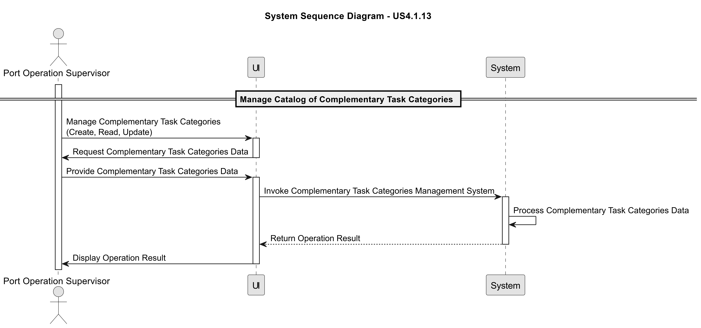
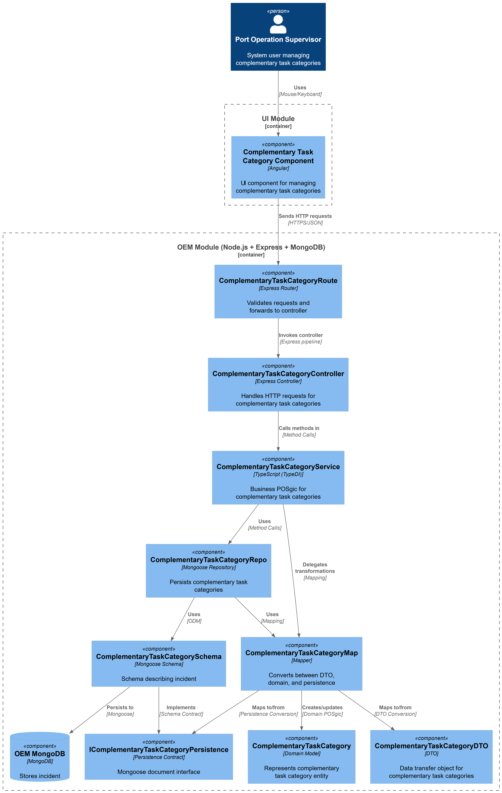
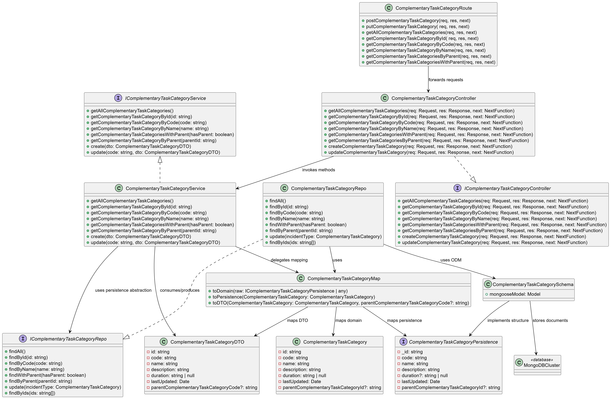

# US 4.1.14

## 1. Context

*The Operations & Execution Management (OEM) module is responsible for managing execution data
of port activities. It bridges the gap between operations planning and operations execution, allowing
the system to record what actually happens during each vessel visit and how it differs from the
planned schedule. Among others, this module aims to support:\
Complementary Tasks & Categories – logging non-cargo-related activities (e.g., inspections,
maintenance, cleaning) that may occur during vessel visits and impact operational efficiency.*

## 2. Requirements

**US 4.1.14** As a Port Operations Supervisor, I want to manage the catalog of
Complementary Task Categories so that non-cargo-related activities are
consistently classified and can be properly recorded during vessel visits.

**Acceptance Criteria:**

- CRUD operations for Complementary Task Categories must be available via the REST API.

- The SPA must allow users to view, search, and manage these categories efficiently.

- Each category must include a unique code (e.g., CTC001), a name (e.g., Security Check, Hull
Maintenance), and a brief description of the task type or context.

- Categories may optionally define a default duration or expected impact (e.g., typically 1h
delay).

- Examples of possible categories:\
o Safety and Security: Onboard Security Check, Customs Inspection\
o Maintenance: Hull Repair, Equipment Calibration\
o Cleaning and Housekeeping: Deck Cleaning, Waste Removal

**Dependencies/References:**

*There are no dependencies in this User Story!*

**Forum Insight:**

>> When updating the complementary task category what are the fields that can be edited? Can it be name, description and duration? I assume the ID cannot be changed.
> 
> All fields, excepting the unique code, might be updated.


>> Na user story 4.1.14 – Complementary Task Categories, os exemplos apresentados (por exemplo, Safety and Security: Onboard Security Check, Customs Inspection) parecem sugerir uma estrutura hierárquica semelhante à definida para os Incident Types na user story 4.1.12.\
A minha dúvida é: as complementary task categories também devem ter hierarquia, à semelhança dos Incident Types?
> 
> You're right. It's not necessary to implement that hierarchy, however, it would be desirable.


## 3. Analysis

Manage Catalog of Incidents



## 4. C4 Model

#### Components - Level 3



#### Code - Level 4




## 5. Tests

### System (end-to-end)
- [OEM/tests/system/ComplementaryTaskCategory.system.test.ts](OEM/tests/system/ComplementaryTaskCategory.system.test.ts) spins up 

```ts
describe("POST /complementary-task-categories", () => {
    it("should create and retrieve a complementary task category from real database", async () => {
      const payload = {
        code: "SYS1",
        name: "System Test Category",
        description: "Created in system test",
        duration: "PT2H"
      };

      const createRes = await request(app)
        .post("/api/complementary-task-categories")
        .send(payload);

      expect(createRes.status).toBe(201);
      expect(createRes.body.code).toBe("SYS1");
      expect(createRes.body.name).toBe("System Test Category");

      // Verificar que foi realmente salvo na BD
      const getRes = await request(app).get("/api/complementary-task-categories/code/SYS1");

      expect(getRes.status).toBe(200);
      expect(getRes.body.name).toBe("System Test Category");
    });

    it("should fail when creating duplicate code in database", async () => {
      const payload = {
        code: "DUP001",
        name: "Duplicate Test",
        description: "Testing duplicates",
        duration: "PT1H"
      };

      // Primeira criação
      await request(app).post("/api/complementary-task-categories").send(payload);

      // Segunda criação com mesmo código deve falhar
      const res = await request(app).post("/api/complementary-task-categories").send(payload);

      expect(res.status).toBe(400);
      expect(res.body.error).toContain("already exists");
    });

    it("should create complementary task category with parent relationship in database", async () => {
      // Criar parent
      await request(app).post("/api/complementary-task-categories").send({
        code: "PARENT_SYS",
        name: "Parent Category",
        description: "Parent category",
        duration: "PT3H"
      });

      // Criar child
      const childRes = await request(app).post("/api/complementary-task-categories").send({
        code: "CHILD_SYS",
        name: "Child Category",
        description: "Child category",
        duration: "PT1H",
        parentComplementaryTaskCategoryCode: "PARENT_SYS"
      });

      expect(childRes.status).toBe(201);
      expect(childRes.body.parentComplementaryTaskCategoryCode).toBe("PARENT_SYS");
    });

    it("should fail when parent does not exist in database", async () => {
      const res = await request(app).post("/api/complementary-task-categories").send({
        code: "ORPHAN",
        name: "Orphan Category",
        description: "No parent category",
        duration: "PT2H",
        parentComplementaryTaskCategoryCode: "NONEXISTENT"
      });

      expect(res.status).toBe(400);
      expect(res.body.error).toContain("not found");
    });

    it("should create complementary task category without duration", async () => {
      const payload = {
        code: "NODUR",
        name: "No Duration",
        description: "Category without duration",
        duration: null
      };

      const createRes = await request(app)
        .post("/api/complementary-task-categories")
        .send(payload);

      expect(createRes.status).toBe(201);
      expect(createRes.body.duration).toBeNull();
    });
  });
```

### Application (routes + controller)
- [OEM/tests/application/ComplementaryTaskCategory.routes.test.ts](OEM/tests/application/ComplementaryTaskCategory.routes.test.ts) 

```ts
describe("ComplementaryTaskCategory Routes (Application Tests)", () => {

  beforeEach(() => {
    jest.clearAllMocks();
  });

  // -----------------------------
  // GET /complementary-task-categories
  // -----------------------------
  it("GET /complementary-task-categories → 200", async () => {
    complementaryTaskCategoryServiceMock.getAllComplementaryTaskCategories.mockResolvedValue({
      isSuccess: true,
      getValue: () => [{ code: "CTC1" }]
    });

    const app = createTestApp();

    const res = await request(app).get("/complementary-task-categories");

    expect(res.status).toBe(200);
    expect(res.body).toEqual([{ code: "CTC1" }]);
  });

  // -----------------------------
  // GET /complementary-task-categories/code/:code
  // -----------------------------
  it("GET /complementary-task-categories/code/:code → 404 when not found", async () => {
    complementaryTaskCategoryServiceMock.getComplementaryTaskCategoryByCode.mockResolvedValue({
      isSuccess: false,
      isFailure: true,
      error: "Complementary task category not found",
      errorValue: () => "Complementary task category not found"
    });

    const app = createTestApp();

    const res = await request(app).get("/complementary-task-categories/code/CTC999");

    expect(res.status).toBe(404);
    expect(res.body.error).toContain("not found");
  });

  it("GET /complementary-task-categories/code/:code → 200 when found", async () => {
    complementaryTaskCategoryServiceMock.getComplementaryTaskCategoryByCode.mockResolvedValue({
      isSuccess: true,
      getValue: () => ({ code: "CTC1", name: "Cleaning" })
    });

    const app = createTestApp();

    const res = await request(app).get("/complementary-task-categories/code/CTC1");

    expect(res.status).toBe(200);
    expect(res.body.code).toBe("CTC1");
  });

  // -----------------------------
  // PUT /complementary-task-categories/update/:code
  // -----------------------------
  it("PUT /complementary-task-categories/update/:code → 404 when code does not exist", async () => {
    complementaryTaskCategoryServiceMock.update.mockResolvedValue({
      isSuccess: false,
      isFailure: true,
      error: "ComplementaryTaskCategory with code 'CTC2' not found.",
      errorValue: () => "ComplementaryTaskCategory with code 'CTC2' not found."
    });

    const app = createTestApp();

    const res = await request(app)
      .put("/complementary-task-categories/update/CTC2")
      .send({
        code: "CTC2",
        name: "Cleaning",
        description: "Cleaning tasks",
        duration: "2h"
      });

    expect(res.status).toBe(404);
    expect(res.body.error).toContain("not found");
  });
```

### Aggregate/Service
- [OEM/tests/aggregate/ComplementaryTaskCategoryAggregate.test.ts](OEM/tests/aggregate/ComplementaryTaskCategoryAggregate.test.ts) 

```ts
describe("ComplementaryTaskCategoryService – Aggregate Tests", () => {

  let repo: ComplementaryTaskCategoryRepoFake;
  let service: ComplementaryTaskCategoryService;

  beforeEach(() => {
    repo = new ComplementaryTaskCategoryRepoFake();
    service = new ComplementaryTaskCategoryService(repo as any, loggerFake);
  });

  // ---------------------------------------------
  // CREATE – robust tests
  // ---------------------------------------------
  it("should create a new ComplementaryTaskCategory (full aggregate flow)", async () => {
    const dto = { code: "C100", name: "AAA", description: "DESC AAA", duration: "2h" };

    const result = await service.create(dto as any);

    expect(result.isSuccess).toBe(true);

    const domain = await repo.findByCode("C100");
    expect(domain).not.toBeNull();
    expect(domain!.name).toBe("AAA");
  });

  it("should create with null duration", async () => {
    const dto = { code: "C101", name: "BBB", description: "DESC BBB", duration: null };

    const result = await service.create(dto as any);

    expect(result.isSuccess).toBe(true);

    const domain = await repo.findByCode("C101");
    expect(domain).not.toBeNull();
    expect(domain!.duration).toBeNull();
  });

  it("should fail to create if code already exists", async () => {
    await repo.save(new ComplementaryTaskCategory("1", "C100", "AAA", "DESC AAA", "1h", new Date()));

    const dto = { code: "C100", name: "BBB", description: "DESC BBB", duration: "2h" };

    const result = await service.create(dto as any);

    expect(result.isFailure).toBe(true);
    expect(result.errorValue()).toContain("already exists");
  });
```

### Unit (domain model)
- [OEM/tests/units/domain/ComplementaryTaskCategory.test.ts](OEM/tests/units/domain/ComplementaryTaskCategory.test.ts) 

```ts
describe("ComplementaryTaskCategory (unit tests)", () => {

  const validData = {
    id: "1",
    code: "CODE1",
    name: "Test Category",
    description: "Valid category description",
    duration: "PT2H",
    lastUpdated: new Date()
  };

  // ------------------------------------------------------------
  // Constructor validation
  // ------------------------------------------------------------

  it("should create a ComplementaryTaskCategory with valid data", () => {
    const category = new ComplementaryTaskCategory(
      validData.id,
      validData.code,
      validData.name,
      validData.description,
      validData.duration,
      validData.lastUpdated
    );

    expect(category.id).toBe("1");
    expect(category.code).toBe("CODE1");
    expect(category.name).toBe("Test Category");
    expect(category.description).toBe("Valid category description");
    expect(category.duration).toBe("PT2H");
  });

  it("should create a ComplementaryTaskCategory with null duration", () => {
    const category = new ComplementaryTaskCategory(
      validData.id,
      validData.code,
      validData.name,
      validData.description,
      null,
      validData.lastUpdated
    );

    expect(category.duration).toBeNull();
  });

  it("should create a ComplementaryTaskCategory with parent", () => {
    const category = new ComplementaryTaskCategory(
      validData.id,
      validData.code,
      validData.name,
      validData.description,
      validData.duration,
      validData.lastUpdated,
      "parent123"
    );

    expect(category.parentComplementaryTaskCategoryId).toBe("parent123");
  });
```

