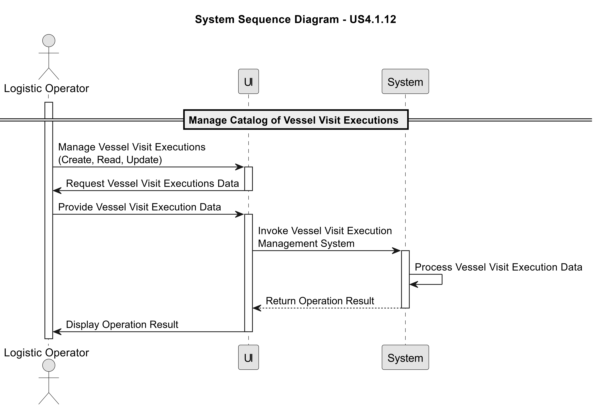
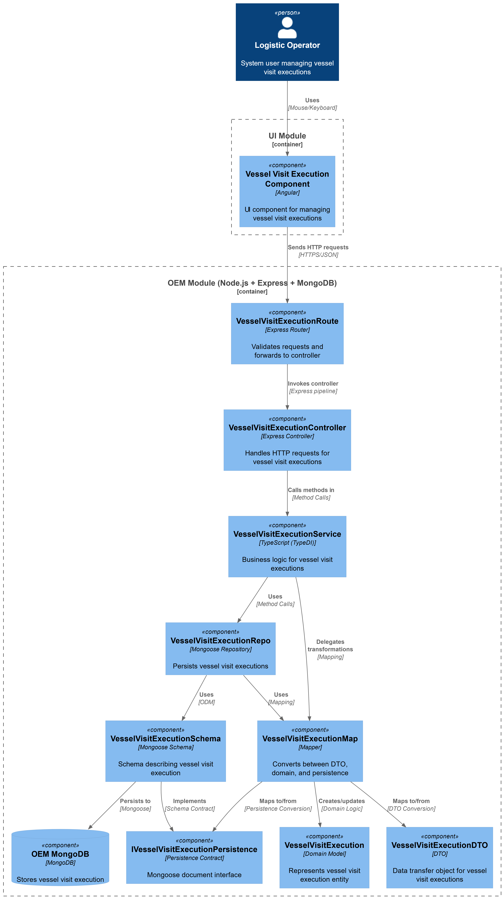
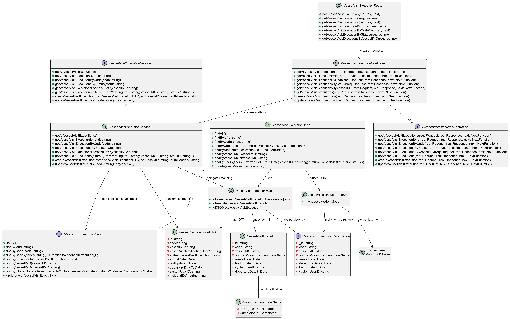

# US 4.1.7

## 1. Context

*The Operations & Execution Management (OEM) module is responsible for managing execution data
of port activities. It bridges the gap between operations planning and operations execution, allowing
the system to record what actually happens during each vessel visit and how it differs from the
planned schedule. Among others, this module aims to support:\
Vessel Visit Executions (VVE) – recording actual vessel arrivals, departures, and the real
execution of cargo operations.*

## 2. Requirements

**US 4.1.7** As a Logistics Operator, I want to create a Vessel Visit Execution (VVE)
record when a vessel arrives at the port, so that the actual start of
operations can be logged and monitored.

**Acceptance Criteria:**

- The REST API must allow creating a new VVE referencing an existing VVN.

- Recorded fields must include vessel identifier, actual arrival time at the port, and creator user
ID. An automatic VVE identifier must be also assigned, whose pattern is like VVN IDs.

- The SPA must easy the VVE creation using available VVN information.

- Once created, the VVE must be marked as “In Progress.”

**Dependencies/References:**

*There is a dependency on US2.2.8 because it needs to be vessel visit executions registered in the system to create a vessel visit execution*
*There is a dependency on US2.2.7 because to create a vessel visit execution, the vessel visit notification needs to be approved*


**Forum Insight:**

>> No documento é referido, na US 4.1.7, que os VVEs, após serem criados, são automaticamente marcados como “In Progress”. Existe mais algum estado posterior a este quando, por exemplo, o vessel associado a esse VVE completa tudo e sai do porto?
> 
> Of course it exists. If you had read all the User Stories (US) for Sprint C, you would have already realized this. Read, for example, US 4.1.11.

>> We would like to clarify the expected system behavior in the OEM module regarding referential integrity and data deletion:\
Deletion of VVE and Dependencies (US 4.1.7 / 4.1.13 / 4.1.15):\
When deleting a Vessel Visit Execution (VVE), what is the expected behavior regarding its dependent records, specifically the associated Incidents and Complementary Tasks?\
• Should the system perform a cascade delete (deleting the VVE automatically deletes the associated incidents and tasks)?\
• Or should the system restrict/block the deletion of the VVE if such associations exist?
Deletion of Categories and Hierarchies (US 4.1.12 / 4.1.14):\
• Complementary Task Categories: If a Task Category is deleted, should the historical Complementary Tasks referencing this category also be deleted, or should the deletion of the category be blocked?\
• Incident Types (Hierarchy): Since Incident Types support a hierarchical structure (Parent/Child), if we delete a "Parent" Incident Type, should its "Child" subtypes be automatically deleted as well?  
> 
> A VVE corresponds to real data, that really happen. From a business point of view, there is no need to delete VVE records.\
Again, it does not make much sense to delete Task Categories that are being used. However, through time, the use of some task categories may be ceased.

## 3. Analysis

Manage Catalog of Vessel Visit Executions



## 4. C4 Model

#### Components - Level 3



#### Code - Level 4




## 5. Tests

### System (end-to-end)
- [OEM/tests/system/VesselVisitExecution.system.test.ts](OEM/tests/system/VesselVisitExecution.system.test.ts) spins up 

```ts
describe("POST /vessel-visit-executions", () => {
    it("should create and retrieve a vessel visit execution from real database", async () => {
      const payload = {
        vesselVisitNotificationCode: "2025-PA-000001",
        arrivalDate: new Date().toISOString()
      };

      const createRes = await request(app)
        .post("/api/vessel-visit-executions")
        .send(payload);

      expect(createRes.status).toBe(201);
      expect(createRes.body.code).toMatch(/^\d{4}-PA-\d{6}$/);
      expect(createRes.body.status).toBe("InProgress");

      const getRes = await request(app).get(`/api/vessel-visit-executions/code/${createRes.body.code}`);

      expect(getRes.status).toBe(200);
      expect(getRes.body.code).toBe(createRes.body.code);
    });

    it("should fail when creating duplicate vessel visit notification code in database", async () => {
      const payload = {
        vesselVisitNotificationCode: "2025-PA-000001",
        arrivalDate: new Date().toISOString()
      };

      await request(app).post("/api/vessel-visit-executions").send(payload);

      const res = await request(app).post("/api/vessel-visit-executions").send(payload);

      expect(res.status).toBe(400);
      expect(res.body.error).toContain("already exists");
    });

    it("should fail when arrivalDate is missing", async () => {
      const res = await request(app).post("/api/vessel-visit-executions").send({
        vesselVisitNotificationCode: "2025-PA-000001"
      });

      expect(res.status).toBe(400);
    });

    it("should fail when vesselVisitNotificationCode is missing", async () => {
      const res = await request(app).post("/api/vessel-visit-executions").send({
        arrivalDate: new Date().toISOString()
      });

      expect(res.status).toBe(400);
    });
  });
```

### Application (routes + controller)
- [OEM/tests/application/VesselVisitExecution.routes.test.ts](OEM/tests/application/VesselVisitExecution.routes.test.ts) 

```ts
describe("VesselVisitExecution Routes (Application Tests)", () => {
  describe("PUT /vessel-visit-executions/:code", () => {
    it("should return 200 when vessel visit execution updated successfully", async () => {
      vesselVisitExecutionServiceMock.updateVesselVisitExecution.mockResolvedValue({
        isSuccess: true,
        getValue: () => ({ 
          code: "2025-PA-000001",
          status: "Completed"
        })
      });

      const app = createTestApp();

      const res = await request(app)
        .put("/vessel-visit-executions/2025-PA-000001")
        .send({
          status: "Completed"
        });

      expect(res.status).toBe(200);
      expect(res.body.status).toBe("Completed");
    });

    it("should return 404 when vessel visit execution not found", async () => {
      vesselVisitExecutionServiceMock.updateVesselVisitExecution.mockResolvedValue({
        isSuccess: false,
        error: "Vessel visit execution with code '2025-PA-999999' not found."
      });

      const app = createTestApp();

      const res = await request(app)
        .put("/vessel-visit-executions/2025-PA-999999")
        .send({
          status: "Completed"
        });

      expect(res.status).toBe(404);
      expect(res.body.error).toContain("not found");
    });

    it("should return 400 when validation fails (missing status)", async () => {
      const app = createTestApp();

      const res = await request(app)
        .put("/vessel-visit-executions/2025-PA-000001")
        .send({});

      expect(res.status).toBe(400);
    });

    it("should return 400 when status is invalid", async () => {
      const app = createTestApp();

      const res = await request(app)
        .put("/vessel-visit-executions/2025-PA-000001")
        .send({
          status: "InvalidStatus"
        });

      expect(res.status).toBe(400);
    });

    it("should call service with InProgress status", async () => {
      vesselVisitExecutionServiceMock.updateVesselVisitExecution.mockResolvedValue({
        isSuccess: true,
        getValue: () => ({ code: "2025-PA-000001", status: "InProgress" })
      });

      const app = createTestApp();

      await request(app)
        .put("/vessel-visit-executions/2025-PA-000001")
        .send({
          status: "InProgress"
        });

      expect(vesselVisitExecutionServiceMock.updateVesselVisitExecution).toHaveBeenCalledWith(
        "2025-PA-000001",
        expect.objectContaining({
          status: "InProgress"
        })
      );
    });

    it("should call service with Completed status and include departureDate", async () => {
      vesselVisitExecutionServiceMock.updateVesselVisitExecution.mockResolvedValue({
        isSuccess: true,
        getValue: () => ({ code: "2025-PA-000001", status: "Completed" })
      });

      const app = createTestApp();

      await request(app)
        .put("/vessel-visit-executions/2025-PA-000001")
        .send({
          status: "Completed"
        });

      expect(vesselVisitExecutionServiceMock.updateVesselVisitExecution).toHaveBeenCalledWith(
        "2025-PA-000001",
        expect.objectContaining({
          status: "Completed",
          departureDate: expect.any(Date)
        })
      );
    });

    it("should return 400 when service returns error other than not found", async () => {
      vesselVisitExecutionServiceMock.updateVesselVisitExecution.mockResolvedValue({
        isSuccess: false,
        error: "Cannot update execution that is already completed"
      });

      const app = createTestApp();

      const res = await request(app)
        .put("/vessel-visit-executions/2025-PA-000001")
        .send({
          status: "InProgress"
        });

      expect(res.status).toBe(400);
      expect(res.body.error).toBe("Cannot update execution that is already completed");
    });

    it("should accept only InProgress or Completed as valid status values", async () => {
      const app = createTestApp();

      const validStatuses = ["InProgress", "Completed"];

      for (const status of validStatuses) {
        vesselVisitExecutionServiceMock.updateVesselVisitExecution.mockResolvedValue({
          isSuccess: true,
          getValue: () => ({ code: "2025-PA-000001", status })
        });

        const res = await request(app)
          .put("/vessel-visit-executions/2025-PA-000001")
          .send({ status });

        expect(res.status).toBe(200);
      }
    });
  });
});
```

### Aggregate/Service
- [OEM/tests/aggregate/VesselVisitExecutionAggregate.test.ts](OEM/tests/aggregate/VesselVisitExecutionAggregate.test.ts) 

```ts
describe("VesselVisitExecutionService – Aggregate Tests", () => {

  let vveRepo: VesselVisitExecutionRepoFake;
  let incidentRepo: IncidentRepoFake;
  let service: VesselVisitExecutionService;
  let mockSystemUserClient: jest.Mocked<SystemUserClient>;
  let mockVVNClient: jest.Mocked<VesselVisitNotificationClient>;

  beforeEach(() => {
    vveRepo = new VesselVisitExecutionRepoFake();
    incidentRepo = new IncidentRepoFake();
    service = new VesselVisitExecutionService(vveRepo as any, incidentRepo as any, loggerFake);

    // Setup mocks
    mockSystemUserClient = new SystemUserClient("http://localhost") as jest.Mocked<SystemUserClient>;
    mockVVNClient = new VesselVisitNotificationClient("http://localhost") as jest.Mocked<VesselVisitNotificationClient>;

    (SystemUserClient as jest.Mock).mockImplementation(() => mockSystemUserClient);
    (VesselVisitNotificationClient as jest.Mock).mockImplementation(() => mockVVNClient);

    // Default mock implementations
    mockSystemUserClient.getMyIsFirstTime = jest.fn().mockResolvedValue({ email: 'test@example.com' });
    mockSystemUserClient.getByEmail = jest.fn().mockResolvedValue({ id: 'user123', email: 'test@example.com' });
    mockVVNClient.getByCode = jest.fn().mockResolvedValue({ 
      id: 1,
      code: 'VVN001', 
      visitStatus: 'Approved', 
      vesselIMO: 'IMO1234567' 
    });
  });
```

### Unit (domain model)
- [OEM/tests/units/domain/VesselVisitExecution.test.ts](OEM/tests/units/domain/VesselVisitExecution.test.ts) 

```ts
describe("VesselVisitExecution (unit tests)", () => {

  const pastDate = new Date("2025-01-15");
  const validData = {
    id: "1",
    code: "2025-PA-000001",
    vesselIMO: "9074729",
    status: VesselVisitExecutionStatus.InProgress,
    arrivalDate: pastDate,
    lastUpdated: new Date(),
    systemUserID: "user123"
  };

  // ------------------------------------------------------------
  // Constructor validation
  // ------------------------------------------------------------

  it("should create a VesselVisitExecution with valid data", () => {
    const execution = new VesselVisitExecution(
      validData.id,
      validData.code,
      validData.vesselIMO,
      validData.status,
      validData.arrivalDate,
      validData.lastUpdated,
      validData.systemUserID
    );

    expect(execution.id).toBe("1");
    expect(execution.code).toBe("2025-PA-000001");
    expect(execution.vesselIMO).toBe("9074729");
    expect(execution.status).toBe(VesselVisitExecutionStatus.InProgress);
    expect(execution.arrivalDate).toBe(pastDate);
    expect(execution.systemUserID).toBe("user123");
    expect(execution.departureDate).toBeUndefined();
  });

  it("should create a VesselVisitExecution with departure date", () => {
    const departureDatePast = new Date("2025-01-20");
    const execution = new VesselVisitExecution(
      validData.id,
      validData.code,
      validData.vesselIMO,
      validData.status,
      validData.arrivalDate,
      validData.lastUpdated,
      validData.systemUserID,
      departureDatePast
    );

    expect(execution.departureDate).toBe(departureDatePast);
  });
```

